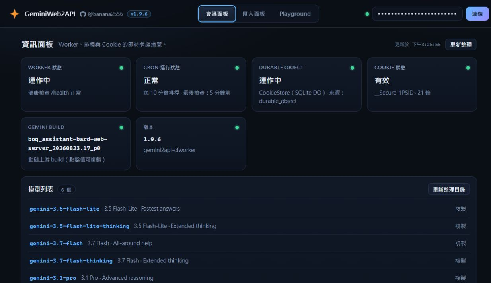
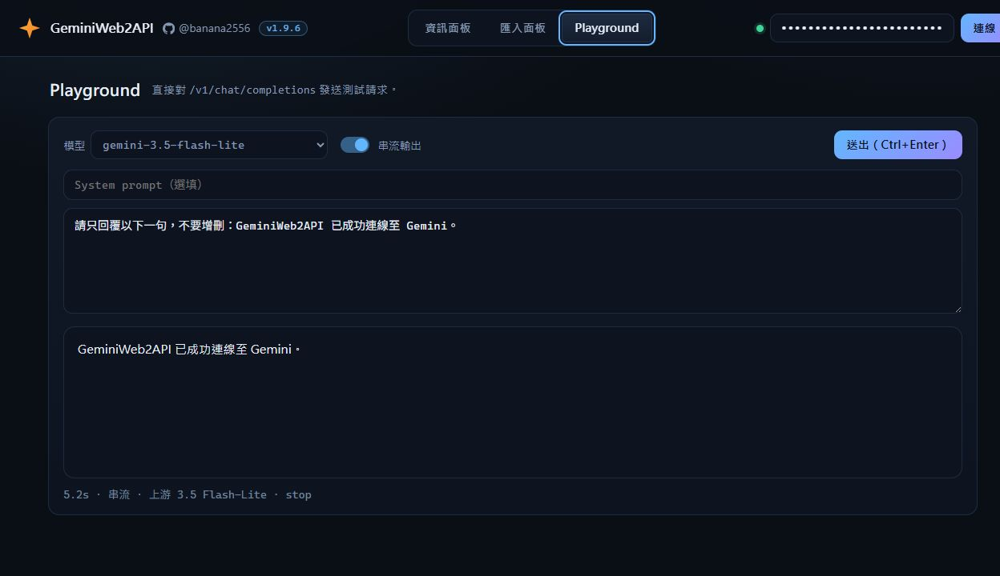
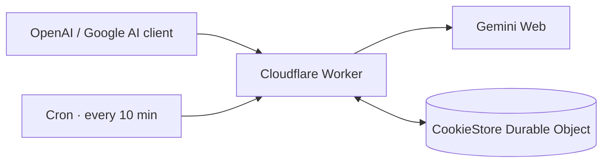

<p align="center">
  
</p>

<h1 align="center">GeminiWeb2API</h1>

<p align="center">
  <strong>Use Gemini Web through OpenAI- and Google AI-compatible APIs on Cloudflare Workers.</strong>
</p>

<p align="center">
  Single Worker file · zero runtime dependencies · streaming · tool calling · image input · web console
</p>

<p align="center">
  <a href="https://github.com/banana2556/gemini2api-cfworker"></a>
  <a href="https://workers.cloudflare.com/"></a>
  <a href="LICENSE"></a>
  <a href="https://github.com/banana2556"></a>
</p>

<p align="center">
  <a href="#quick-start">Quick start</a> ·
  <a href="#client-examples">Client examples</a> ·
  <a href="#configuration">Configuration</a> ·
  <a href="#api-reference">API reference</a> ·
  <a href="#troubleshooting">Troubleshooting</a>
</p>



<p align="center"><sub>Live deployment capture. The API key is masked and no Cookie value is displayed.</sub></p>

GeminiWeb2API translates Gemini Web's StreamGenerate protocol into familiar
OpenAI and Google AI request/response formats. It runs entirely on Cloudflare
Workers and includes a browser console for model discovery, Cookie management,
health checks, and live requests.

> [!IMPORTANT]
> This is an unofficial compatibility layer, not a Google or OpenAI service.
> Gemini Web protocol changes can break it without notice. Use only accounts
> and Cookies you control, and follow the applicable terms and usage limits.

## At a glance

| Interface | Endpoint | Highlights |
|---|---|---|
| OpenAI Chat Completions | `POST /v1/chat/completions` | Streaming, tool calls, image input |
| OpenAI Responses | `POST /v1/responses` | Codex-compatible events and tool calls |
| Google AI | `POST /v1beta/models/{model}:generateContent` | Streaming and function calling |
| Browser console | `GET /` | Status, models, Cookie lifecycle, Playground |

Image input and signed-in model routes require a Gemini Cookie. Anonymous text
requests work without configuration through Gemini's guest auto-routing mode.

## Highlights

- **Drop-in client compatibility** for OpenAI-style and Google AI-style clients.
- **Dynamic model discovery** from the active Gemini account instead of a
  hard-coded model list.
- **Standard and Extended Thinking** aliases for Flash-Lite, Flash, and Pro.
- **Transparent routing metadata** through `upstream_model` / `upstreamModel`
  and `route_status` / `routeStatus`.
- **Persistent Cookie storage** in a SQLite Durable Object, with an automatic
  ten-minute refresh Cron Trigger.
- **Cloudflare egress fallback** using raw TCP sockets when normal `fetch`
  traffic is rate-limited.
- **Single-file runtime** with no application dependencies.

## Quick start

### 1. Deploy

[](https://deploy.workers.cloudflare.com/?url=https://github.com/banana2556/gemini2api-cfworker)

Or deploy with Wrangler:

```bash
git clone https://github.com/banana2556/gemini2api-cfworker.git
cd gemini2api-cfworker
npx wrangler deploy
```

The checked-in `wrangler.toml` provisions the `COOKIE_STORE` Durable Object
and the ten-minute Cron Trigger. Pasting only `worker.js` into Cloudflare
Quick Edit supports guest mode, but does not provision persistent Cookie
storage or scheduled refresh.

### 2. Choose an access mode

| Mode | Setup | Available routes |
|---|---|---|
| Guest | No variables or Cookie | `gemini-auto`, `gemini-auto-thinking`; text requests |
| Signed in | `API_KEYS` secret + imported Gemini Cookie | Account model catalog, image input, Pro/Flash routing |

For signed-in mode, protect the Worker before importing a Cookie:

```bash
npx wrangler secret put API_KEYS
```

`API_KEYS` accepts a comma-separated list or a JSON array. The same keys
protect API requests and unlock the browser console.

> [!CAUTION]
> An imported Cookie grants access to the connected Gemini session. Once a
> Cookie exists, the Worker deliberately refuses generation unless
> `API_KEYS` is configured.

### 3. Open the console

Visit the deployed Worker URL in a browser:

1. Enter one of the configured API keys.
2. Open **Import / 匯入面板** and paste a Cookie from a signed-in
   `gemini.google.com` request.
3. Refresh or verify the Cookie.
4. Confirm that the expected models appear in **Information / 資訊面板**.
5. Send a test request from **Playground**.

The imported Cookie must include `SAPISID` and a valid session Cookie such as
`__Secure-1PSID`. Cookie values are stored only in the Durable Object and are
never returned by status endpoints.

### 4. Verify the deployment

```bash
curl https://your-worker.workers.dev/health

curl https://your-worker.workers.dev/v1/models \
  -H "Authorization: Bearer your-api-key"
```

Omit the authorization header only when using guest mode with an empty
`API_KEYS` configuration.

## Client examples

Always fetch `/v1/models` first. Model versions are discovered from the
current account and can differ between rollout cohorts.

### OpenAI SDK

```python
from openai import OpenAI

client = OpenAI(
    base_url="https://your-worker.workers.dev/v1",
    api_key="your-api-key",  # Any non-empty placeholder works in open guest mode.
)

models = client.models.list()
model = models.data[0].id

response = client.chat.completions.create(
    model=model,
    messages=[{"role": "user", "content": "Hello!"}],
    stream=True,
)

for chunk in response:
    print(chunk.choices[0].delta.content or "", end="")
```

### Responses API

```bash
curl https://your-worker.workers.dev/v1/responses \
  -H "Authorization: Bearer your-api-key" \
  -H "Content-Type: application/json" \
  -d '{
    "model": "gemini-3.7-flash",
    "input": "Explain Cloudflare Workers in one sentence.",
    "stream": false
  }'
```

### Google AI format

```bash
curl https://your-worker.workers.dev/v1beta/models/gemini-3.7-flash:generateContent \
  -H "x-goog-api-key: your-api-key" \
  -H "Content-Type: application/json" \
  -d '{
    "contents": [
      {"parts": [{"text": "Hello!"}]}
    ]
  }'
```

The model IDs above are examples. Substitute an ID returned by your own
`GET /v1/models` or `GET /v1beta/models` request.

## Web console

The console is served by the Worker itself and does not require a separate
frontend deployment.

- **Information / 資訊面板** — Worker, Cron, Durable Object, Cookie, build, and model
  status.
- **Import / 匯入面板** — Cookie import, refresh, verification, and removal.
- **Playground** — model selection, optional system prompt, streaming, and
  route metadata.



<p align="center"><sub>Live streaming request through <code>/v1/chat/completions</code>; credentials remain masked.</sub></p>

## Models and routing

With a configured Cookie, `GET /v1/models` builds six aliases from Gemini's
current `GetUserStatus` response:

| Family | Standard | Extended Thinking |
|---|---|---|
| Flash-Lite | `gemini-{version}-flash-lite` | `gemini-{version}-flash-lite-thinking` |
| Flash | `gemini-{version}-flash` | `gemini-{version}-flash-thinking` |
| Pro | `gemini-{version}-pro` | `gemini-{version}-pro-thinking` |

- Standard aliases use Gemini Web thinking level `1`.
- Extended Thinking aliases use level `2`.
- Level `3` is the separate Deep Think feature and is not exposed here.
- The signed-in catalog is cached for ten minutes and invalidated when the
  stored Cookie changes.
- `GET /v1/models?refresh=1` forces a fresh catalog lookup.

Without a Cookie, the Worker exposes only `gemini-auto` and
`gemini-auto-thinking`. Unknown client aliases remain usable in guest mode:
a `*-thinking` suffix keeps Extended Thinking, while other names map to
`gemini-auto`.

Responses preserve the requested alias and separately report the actual
upstream model and route status. This makes Pro fallback visible instead of
silently claiming the requested route succeeded.

<details>
<summary><strong>Paid account and Pro route details</strong></summary>

Paid Gemini / Google AI Pro accounts require Gemini Web's model-select header
(`x-goog-ext-525001261-jspb`). The Worker derives it from the current model ID
and account capacity returned by `GetUserStatus`. Use the console's Cookie
verification or `/debug` to distinguish:

- `pro_route_verified` — the request reached a Pro upstream model.
- `configured_but_pro_unavailable` — the request worked but fell back.
- `unverified` — Gemini returned no upstream model label.

</details>

## How it works



The Worker converts client messages and tools into Gemini Web payloads, streams
the upstream response back in the requested API format, and attaches truthful
routing metadata. Images are uploaded through Google's Scotty upload flow
before generation.

## Configuration

Edit `CONFIG` near the top of `worker.js`, or provide a Worker variable or
secret with the same name. Keep `API_KEYS` in Cloudflare Secrets.

| Variable | Required | Default | Purpose |
|---|---|---|---|
| `API_KEYS` | With a Cookie | `[]` | Comma-separated keys or JSON array for APIs and console access |
| `GEMINI_BL` | No | Auto-detected fallback | Gemini Web build used if automatic discovery fails |
| `GEMINI_ORIGIN` | No | `https://gemini.google.com` | Upstream origin or a clean-IP relay |
| `UPSTREAM_SOCKET` | No | `true` | Prefer raw TCP before falling back to `fetch` |
| `DEFAULT_MODEL` | No | `""` | Preferred alias; otherwise Flash Standard or guest auto |
| `RETRY_ATTEMPTS` | No | `3` | Maximum upstream attempts |
| `RETRY_DELAY_SEC` | No | `2` | Delay between retries |
| `REQUEST_TIMEOUT_SEC` | No | `180` | Timeout for each upstream request |
| `LOG_REQUESTS` | No | `true` | Request logging |
| `ENABLE_DEBUG` | No | `true` | Enable the live `/debug` probe |

Gemini login fields are intentionally not read from Worker variables or
secrets. Legacy `GEMINI_COOKIE`, `SAPISID`, `GEMINI_AUTH_USER`, and
`GEMINI_XSRF_TOKEN` values are ignored and can be removed.

For a public production deployment, consider setting `ENABLE_DEBUG=false`
after setup and troubleshooting are complete.

## API reference

| Method | Path | Description |
|---|---|---|
| `GET` | `/` | Browser console for HTML clients; health JSON otherwise |
| `GET` | `/health` | Public health, version, and current Gemini build |
| `GET` | `/v1/models` | OpenAI-style dynamic model catalog |
| `POST` | `/v1/chat/completions` | OpenAI Chat Completions |
| `POST` | `/v1/responses` | OpenAI Responses-compatible endpoint |
| `GET` | `/v1beta/models` | Google-style dynamic model catalog |
| `POST` | `/v1beta/models/{model}:generateContent` | Google non-streaming generation |
| `POST` | `/v1beta/models/{model}:streamGenerateContent` | Google SSE generation |
| `GET` | `/admin/status` | Masked storage and Cookie status |
| `PUT` | `/admin/cookie` | Import a Cookie or Cookie Sync JSON |
| `POST` | `/admin/cookie/refresh` | Validate and persist approved Cookie rotations |
| `DELETE` | `/admin/cookie` | Remove the stored Cookie and return to guest mode |
| `GET` | `/debug` | Connectivity, masked Cookie status, and route probes |

### Authentication

Generation endpoints accept:

- `Authorization: Bearer <key>`
- `x-api-key: <key>`
- `x-goog-api-key: <key>`
- `api-key: <key>` or `apikey: <key>`
- `?key=<key>` for client compatibility

Prefer headers so keys do not appear in URLs or access logs. Cookie-management
endpoints use the same `API_KEYS` values but never accept query-string keys.

When `API_KEYS` is empty and no Cookie is stored, generation is public in
guest mode. When a Cookie exists, generation fails closed until a valid API
key is configured.

## Cookie lifecycle and security

- The console keeps the API key only in the current tab's `sessionStorage`.
- Raw Cookie values live only in `COOKIE_STORE` and are never included in
  status responses.
- Imports are normalized to approved authentication and anti-abuse fields;
  unrelated preference, search, and billing fields are discarded.
- Page-token caches are isolated by a cryptographic Cookie fingerprint, so
  switching accounts cannot reuse the previous account's XSRF token.
- Durable Object storage survives normal Worker deployments.

<details>
<summary><strong>Automatic refresh behavior</strong></summary>

Every ten minutes, the Cron Trigger calls Google's `RotateCookies` endpoint,
loads the signed-in Gemini app page, stores the newest page token, merges only
approved `Set-Cookie` rotations, and persists the result.

Manual refresh returns `refreshed`, `no_rotation`, or
`reauth_required`. Rotation can extend a valid session but cannot recreate an
expired Google login. Re-import the Cookie when Google rejects the session,
the Cookie is manually removed, or Durable Object storage is deleted.

The ten-minute model catalog cache is separate from the ten-minute session
refresh cadence.

</details>

## Troubleshooting

| Symptom | What to check |
|---|---|
| Production responses are empty or return `429` | Keep `UPSTREAM_SOCKET=true`, try a clean-IP `GEMINI_ORIGIN`, then inspect `/debug` |
| Responses suddenly become empty | Gemini build discovery is automatic; check `/health`, `/debug`, and upstream availability |
| `401 invalid api key` | Confirm the configured `API_KEYS` value and send it with a supported header |
| `503 api_keys_required_with_cookie` | Add `API_KEYS`; signed-in sessions are never exposed without protection |
| Pro requests fall back | Inspect `upstream_model` and `route_status`; verify that the account has Pro access |
| Cookie refresh reports `reauth_required` | Export a fresh Cookie from a signed-in Gemini browser session |

`GEMINI_BL` is discovered from Gemini's app page and cached for one hour per
origin. The configured value is only a fallback.

## Development

No install step is required for the Worker itself. Run the built-in Node test
suite with:

```bash
node --test
```

Then deploy with `npx wrangler deploy`.

## Limitations

- Gemini Web is an undocumented upstream protocol and may change.
- Guest mode usually routes to Flash-Lite and does not guarantee a requested
  Pro or Flash family.
- Image input requires a valid signed-in Cookie.
- Deep Think is not exposed as a model alias.
- Upstream account limits, regional availability, and service terms still
  apply.

## License

[MIT](LICENSE) © [banana2556](https://github.com/banana2556)
